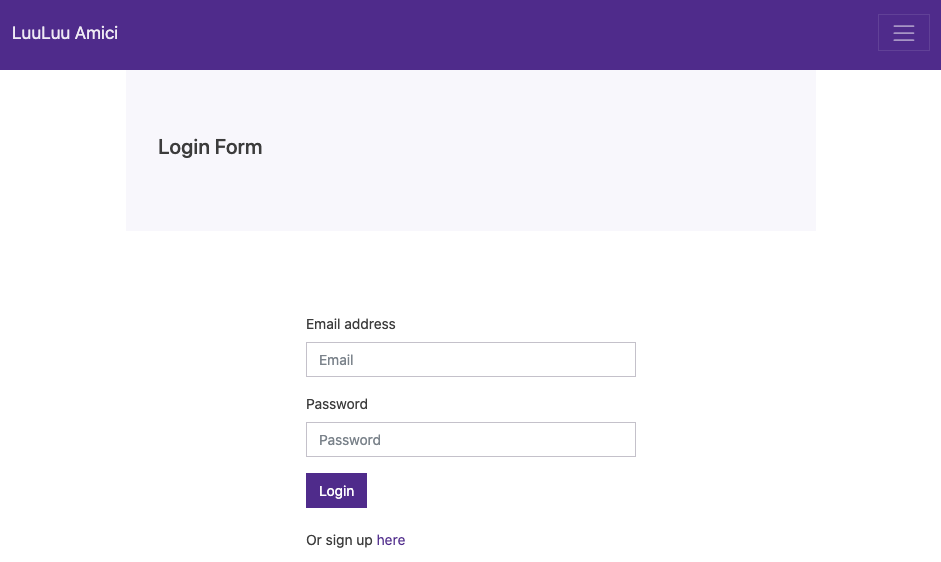
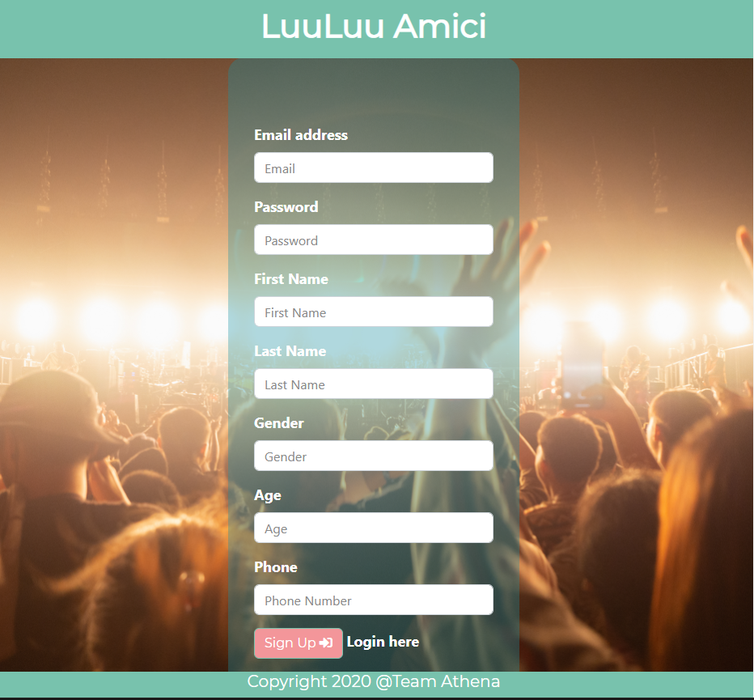
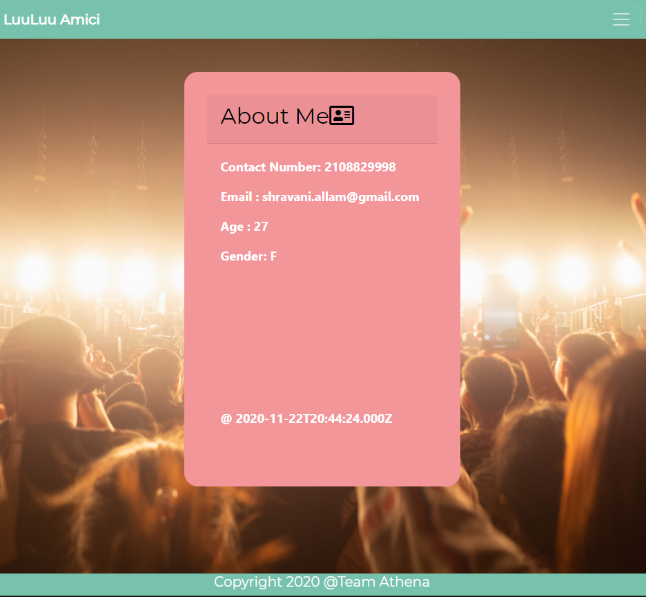
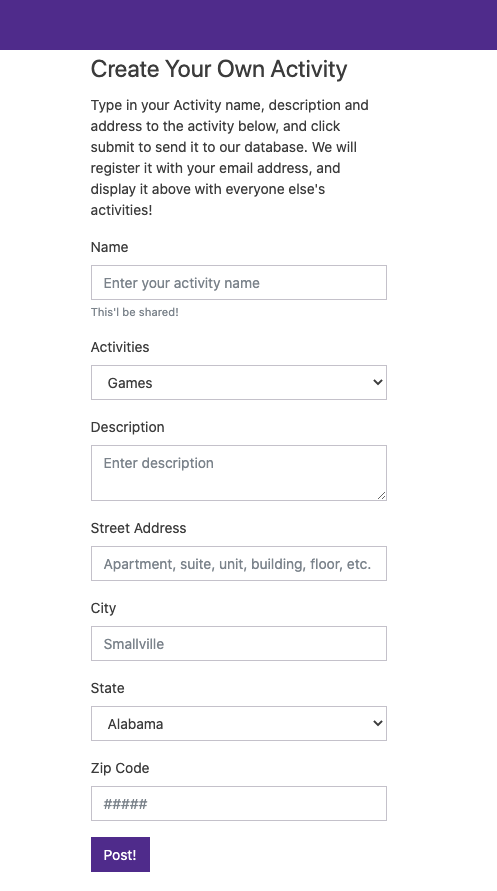
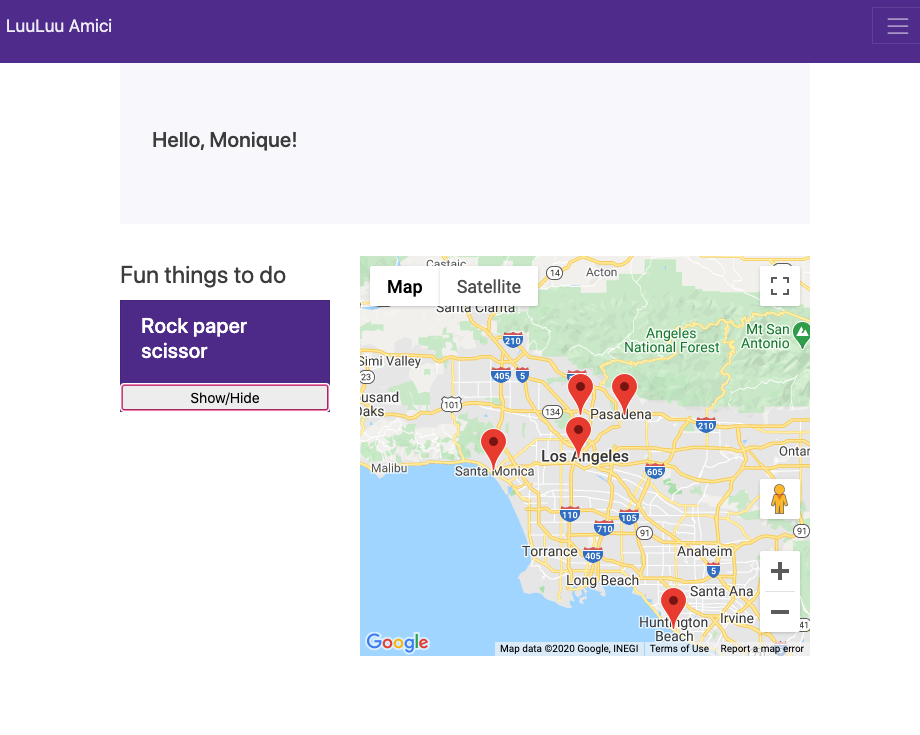

# LuuLuu Amici - app 
A simple app for bored friends to find activities together using node.js, MySQL, and Handlebars.

## Live Application Link: https://ournewproject2.herokuapp.com/

## Table of contents
* [General info](#general-info)
* [Technologies](#technologies)
* [Setup](#setup)
* [License](#license)
* [Installation](#installation)

## General Info
### Features
- Create a profile
- Meet up with people near you
- Be able to create your own activities and post them
- Find activities that others post

### How to get started

### Login Page

### Signup Page

### Profile Page

### Creat your own activity

### Find other activities

## Technologies
Project is created with:
- Express
- Express Handlebars
- Morgan
- Sequelize
- Passport
- Passport-Local
- Cypress
 
## Routing

Api-routes: It  requires models and passport as we have configured it and it consists of all CRUD routes which gets the data, creates new data, updates the data and deletes the  data from the MYSQL database.

* GET  '/api/activities' : This gets all the activities created by different users in json format
* POST '/api/activities' : This posts user's activity, i.e., adds to the database.
* GET '/api/users' : This gets all the users information in json format
* POST '/api/users' : This posts users information.

Html-routes : It requires a path so we use relative routes to html files.It also requires custom middleware for checking if a user is logged in.

* GET '/' : This routes to login html page
* GET '/login' : This routes to login html page 
* GET 'signup' : This routes to signup html page
* GET '/activity' : This routes to page where you can create a new activity
* GET '/current' : This routess to all the activities posted by different users

## Setup
To setup this project, install it locally using npm.

$ npm init -y 
$ npm install
$ npm install mysql
$ npm install express
$ npm install handlbars

### Installation
To install and run locally, first clone repository:

https://github.com/ShravaniAllamReddy/TeamAthena-Project2.git

Then install necessary dependencies.

- (Above in Setup)

Run the Node.js server

- node server.js

Access app through browser with:

- localhost:8080

## License
This project is licensed under MIT License.
